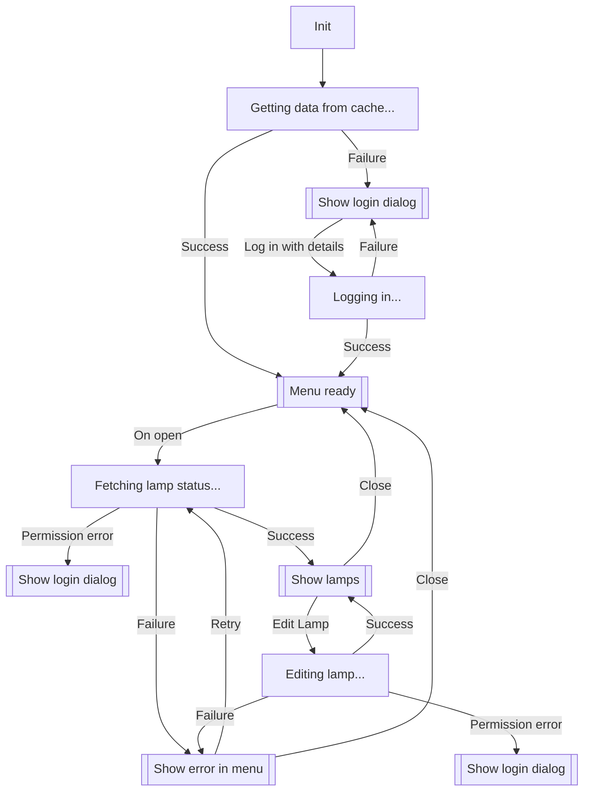

# Menhue - Status bar interface for Phillips Hue lights

Mostly an open-source clone of https://huemenu.app/, but without the (IMO) excessive polling it does to always be up to date. Starting a request on click is enough to feel interactive.

Very feature-incomplete and work-in-progress, don't actually use this for anything other than inspiration for how to use [`objc2`](https://docs.rs/objc2/).


## Design decisions

Uses only Cocoa APIs, to get a feel for what that's like.

In a real-world application, I'd strongly recommend `serde` and `serde_json` for interacting with JSON data, and `reqwest` for doing the URL requests.


## Future ideas

- Integrate with `AppIntents`, and support Siri, automations, and so on.
- Actually, maybe let the automations be written in Automator itself, and then parse those, and send them to the lamp in a fashion it understands?
- Maybe all of this can be done by integrating with `HomeKit`?
- `SensorKit` for ambient light?
  - Or: https://stackoverflow.com/questions/17625495/how-do-you-programmatically-access-the-ambient-light-sensor-on-mac-os-x-10-5
  - https://github.com/insidegui/DarkModeBuddy
- Use https://developer.apple.com/documentation/systemconfiguration/1514895-scnetworkreachabilitycreatewitha?language=objc (or the equivalent from the Network framework)
- See also https://developer.apple.com/documentation/widgetkit?language=objc


## Notes

Detecting `mouseEntered:`/`mouseExited:` for status bar buttons is not possible, even with replacing the class.

Old API docs: https://developers.meethue.com/develop/hue-api/, https://www.burgestrand.se/hue-api/
Developer: https://$HOST/debug/clip.html


## State machine WIP



## Nix

```nix
# darwin-configuration.nix
{
  imports = [ menhue/service.nix ];

  services.menhue = {
    enable = true;
    host = "...";
    username = "...";
  };
}
```
